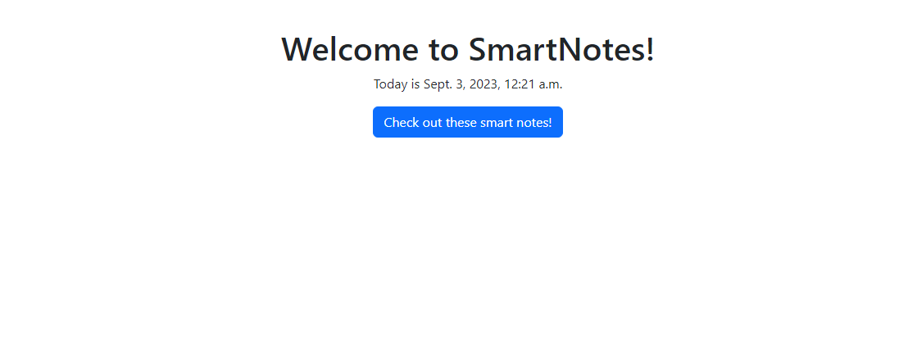
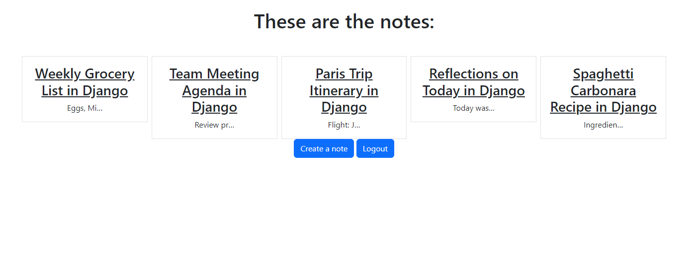
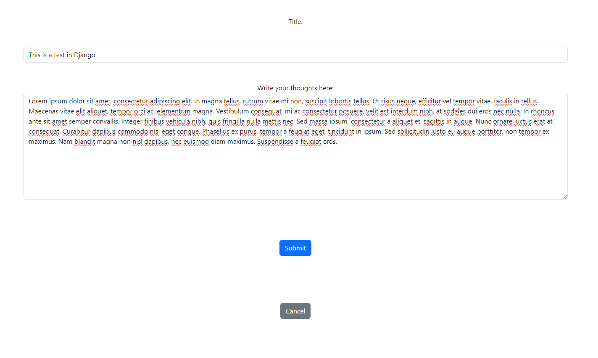
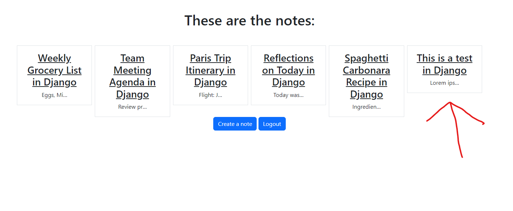
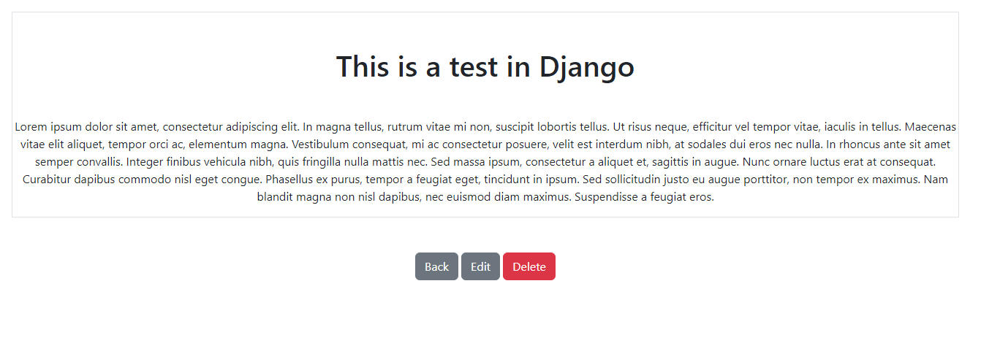
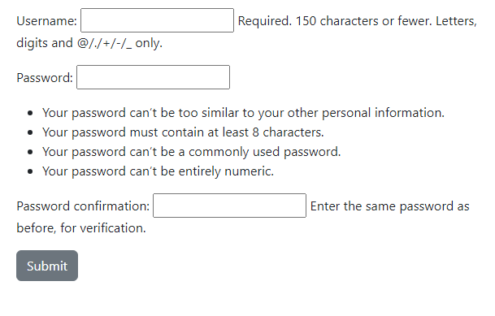

# SmartNotes
Program that uses django to create, update, delete, and retrieve notes.

# Detail
The SmartNotes project is a Python-based application that allows users to create, update, delete, and retrieve notes for future reference.

It employs HTTP protocols and a Django database to store user-generated notes, managing user accounts to enable them to access their previously saved notes and create new ones once logged in.

Additionally, the project utilizes Bootstrap to create a user-friendly frontend interface.

# Snapshots

